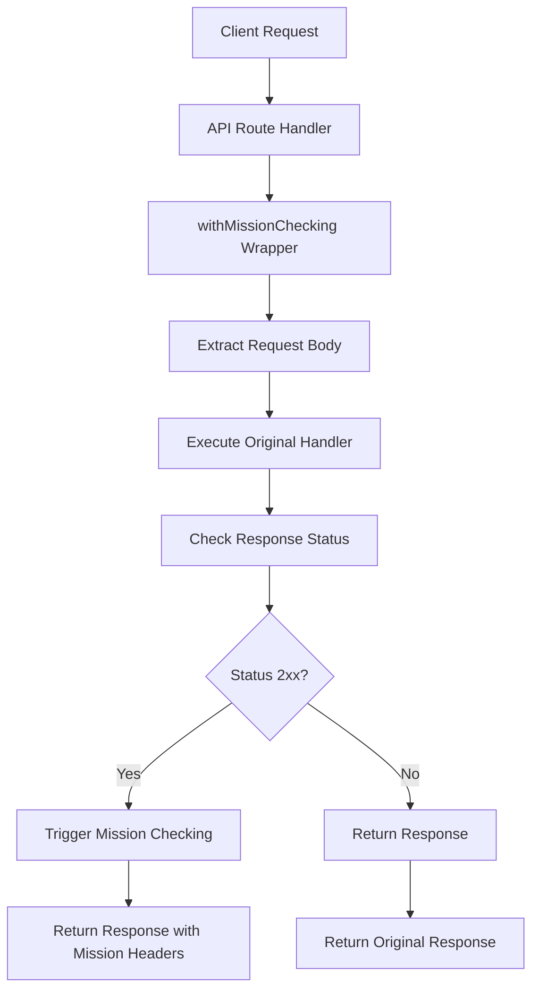
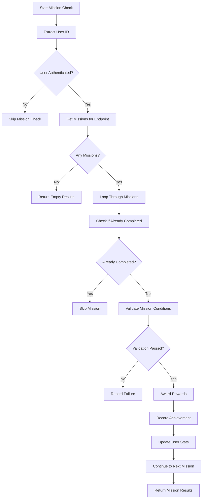
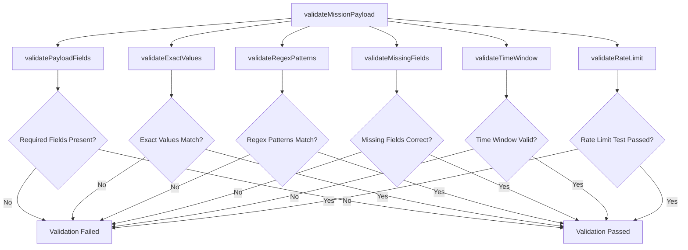
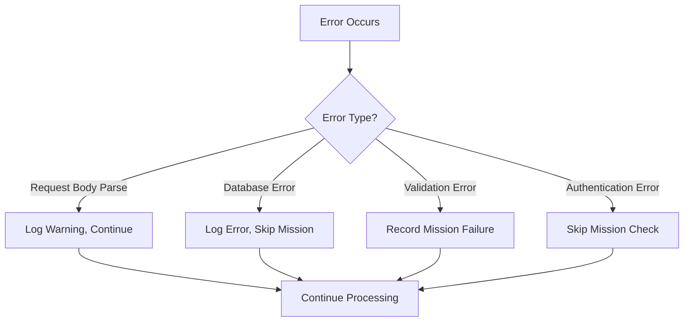

# Mission Validation Flow

## Overview

This document describes the complete flow of mission checking and validation in the API Drop Missions system.

## Flow Diagram

```mermaid
sequenceDiagram
    participant Client
    participant API Route
    participant Mission Middleware
    participant Mission Service
    participant Mission Repository
    participant Mission Validator
    participant Database

    Note over Client, Database: 1. API Request Flow
    Client->>API Route: POST /api/v1/transactions/create
    Note right of Client: Headers: X-API-Key, Content-Type<br/>Body: {"amount": 100, "toBankNumber": "..."}

    Note over API Route, Database: 2. Mission Middleware Wrapper
    API Route->>Mission Middleware: withMissionChecking(POSTHandler)

    Note over Mission Middleware, Database: 3. Request Body Extraction
    Mission Middleware->>Mission Middleware: Extract request body before consumption
    Note right of Mission Middleware: Clone request and parse JSON<br/>Store in requestBody variable

    Note over API Route, Database: 4. Original API Handler
    Mission Middleware->>API Route: Execute original POSTHandler
    API Route->>Database: Process transaction
    Database-->>API Route: Transaction result
    API Route-->>Mission Middleware: NextResponse (201 Created)

    Note over Mission Middleware, Database: 5. Mission Checking (Only on 2xx responses)
    alt Response Status >= 200 && < 300
        Mission Middleware->>Mission Middleware: checkMissions(request, response, options, requestBody)

        Note over Mission Middleware, Database: 6. User Authentication
        Mission Middleware->>Mission Middleware: extractUserId(request)
        Mission Middleware->>Mission Middleware: checkUserAuthOrThrowError()
        Note right of Mission Middleware: Extract user ID from API key

        Note over Mission Middleware, Database: 7. Get Missions for Endpoint
        Mission Middleware->>Mission Service: getMissionsForEndpoint(endpoint, method)
        Mission Service->>Mission Repository: getMissionsForEndpoint(endpoint, method)
        Mission Repository->>Database: SELECT * FROM mission WHERE endpoint = ? AND method = ? AND status = 'active'
        Database-->>Mission Repository: Mission records
        Mission Repository-->>Mission Service: Missions array
        Mission Service-->>Mission Middleware: Missions array

        Note over Mission Middleware, Database: 8. Mission Validation Loop
        loop For each mission
            Mission Middleware->>Mission Middleware: Create ValidationContext
            Note right of Mission Middleware: {payload, headers, endpoint, method, userId, timestamp}

            Mission Middleware->>Mission Service: checkMissionCompletion(userId, missionId, context)

            Note over Mission Service, Database: 9. Check if Already Completed
            Mission Service->>Mission Repository: hasUserCompletedMission(userId, missionId)
            Mission Repository->>Database: SELECT * FROM user_mission_achievement WHERE userId = ? AND missionId = ?
            Database-->>Mission Repository: Achievement record (if exists)
            Mission Repository-->>Mission Service: Boolean result

            alt Not Already Completed
                Note over Mission Service, Database: 10. Mission Validation
                Mission Service->>Mission Validator: validateMissionPayload(mission.conditions, context)

                Note over Mission Validator, Database: 11. Validation Types
                Mission Validator->>Mission Validator: validatePayloadFields()
                Note right of Mission Validator: Check required fields exist

                Mission Validator->>Mission Validator: validateExactValues()
                Note right of Mission Validator: Check exact value matches

                Mission Validator->>Mission Validator: validateRegexPatterns()
                Note right of Mission Validator: Check regex patterns

                Mission Validator->>Mission Validator: validateMissingFields()
                Note right of Mission Validator: Check for missing fields

                Mission Validator->>Mission Validator: validateTimeWindow()
                Note right of Mission Validator: Check time constraints

                Mission Validator->>Mission Validator: validateRateLimit()
                Note right of Mission Validator: Check rate limit scenarios

                Mission Validator-->>Mission Service: ValidationResult {isValid, reason}

                alt Mission Validated Successfully
                    Note over Mission Service, Database: 12. Award Rewards
                    Mission Service->>Mission Service: awardMissionRewards(userId, mission)

                    Note over Mission Service, Database: 13. Record Achievement
                    Mission Service->>Mission Repository: recordMissionCompletion(userId, missionId, payload)
                    Mission Repository->>Database: INSERT INTO user_mission_achievement
                    Database-->>Mission Repository: Achievement record

                    Note over Mission Service, Database: 14. Award Super Tokens
                    Mission Service->>Database: UPDATE user SET superTokens = superTokens + ? WHERE id = ?

                    Note over Mission Service, Database: 15. Award Badges
                    Mission Service->>Database: INSERT INTO user_reward (userId, rewardId)

                    Mission Service-->>Mission Middleware: {success: true, message: "Mission completed", data: {rewards, superTokensAwarded, badgesAwarded}}
                else Mission Validation Failed
                    Mission Service-->>Mission Middleware: {success: false, message: "Mission conditions not met: " + reason}
                end
            else Already Completed
                Mission Service-->>Mission Middleware: {success: false, message: "Mission already completed"}
            end
        end

        Note over Mission Middleware, Database: 16. Update Response Headers
        Mission Middleware->>Mission Middleware: Add mission headers to response
        Note right of Mission Middleware: X-Missions-Completed: 1<br/>X-Missions-Total: 1
    end

    Note over Mission Middleware, Database: 17. Return Final Response
    Mission Middleware-->>Client: NextResponse with mission headers
    Note right of Client: Response includes:<br/>- Transaction data<br/>- Mission completion headers<br/>- Status 201 Created
```

## Detailed Component Flow

### 1. Request Processing

### 2. Mission Validation Process

### 3. Validation Types

## Key Components

### Mission Middleware (`src/lib/mission-middleware.ts`)

- **`withMissionChecking()`**: Higher-order function that wraps API handlers
- **`checkMissions()`**: Main function that orchestrates mission checking
- **`extractUserId()`**: Extracts user ID from API key authentication

### Mission Service (`src/domain/mission-domain/mission-service.ts`)

- **`getMissionsForEndpoint()`**: Retrieves active missions for specific endpoint
- **`checkMissionCompletion()`**: Checks if user completed a specific mission
- **`awardMissionRewards()`**: Awards rewards when mission is completed

### Mission Validator (`src/lib/mission-validator.ts`)

- **`validateMissionPayload()`**: Main validation function
- **`extractPayload()`**: Extracts payload from request
- **`extractHeaders()`**: Extracts headers from request

### Mission Repository (`src/domain/mission-domain/mission-repository.ts`)

- **`getMissionsForEndpoint()`**: Database query for missions
- **`hasUserCompletedMission()`**: Check if user already completed mission
- **`recordMissionCompletion()`**: Record achievement in database

## Error Handling

## Performance Considerations

1. **Request Body Extraction**: Done once before handler execution
2. **Database Queries**: Optimized with proper indexing
3. **Mission Checking**: Only on successful responses (2xx)
4. **Error Isolation**: Mission errors don't affect main API response
5. **Caching**: Future enhancement for frequently accessed missions

## Security Features

1. **Authentication**: Validates API key before mission checking
2. **Input Validation**: Validates all mission conditions
3. **SQL Injection Protection**: Uses Prisma ORM
4. **Error Information**: Limited error details in production
